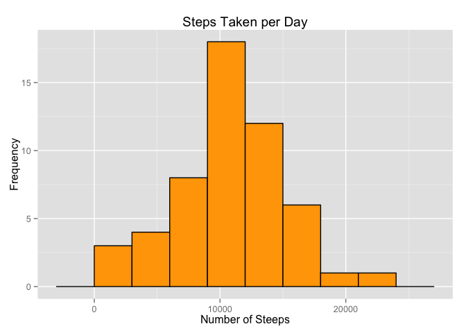
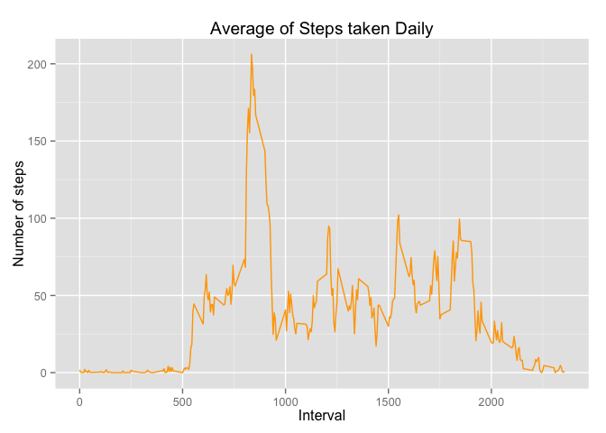

# Reproducible Research: Peer Assessment 1
Ricardo Gutiérrez (@kyeeh)  
## Preparing R environment
This actions are required to perform the markdown document:

1. Set Working directory.
2. Load libraries required.
3. Define Markdown options for this document.


```r
setwd("~/Documents/Coursera/dss/5.- Reproducible Research/Projects/RepData_PeerAssessment1")
library(ggplot2)
library(knitr)
library(plyr)
opts_chunk$set(echo = TRUE, results = 'hold')
```


## Loading and preprocessing the data
Data Loading starts reading *CVS* input file located into `data/`folder, the 
working directory is defined as well. Preprocessing consists in remove `NA` 
observations using the following code: 


```r
setwd("~/Documents/Coursera/dss/5.- Reproducible Research/Projects/RepData_PeerAssessment1")
data <- read.csv("data/activity.csv", na.strings = 'NA')
```

This is a little sample of the data loaded:

```r
head(data,10)
```

```
##    steps       date interval
## 1     NA 2012-10-01        0
## 2     NA 2012-10-01        5
## 3     NA 2012-10-01       10
## 4     NA 2012-10-01       15
## 5     NA 2012-10-01       20
## 6     NA 2012-10-01       25
## 7     NA 2012-10-01       30
## 8     NA 2012-10-01       35
## 9     NA 2012-10-01       40
## 10    NA 2012-10-01       45
```

## What is mean total number of steps taken per day?
For this part of the assignment, missing values will be ignored in the dataset. 
In order to answer the question, the first steep is to preparate the data for 
calculations, then let's make a histogram of the total number of steps taken 
each day: 

```r
sbd <- aggregate(steps ~ date, data = data, FUN=sum,na.rm=TRUE)
ggplot(sbd,aes(x=steps)) + geom_histogram(binwidth = 1500, colour = "black", 
  fill = "orange") + labs(title = "Steps Taken per Day", x="Number of Steeps",
  y="Frequency")
```

 

Now, let's calculate the mean and median for the distibution shown above:

```r
ma <- mean(sbd$steps,na.rm=TRUE)
md <- median(sbd$steps,)
```
Results:

* Mean = **10766.19**
* Median = **10765**

## What is the average daily activity pattern?
In order to show the daily activity pattern, let's plot the average number of 
steps taken daily against the interval number. The first steep is to preparate 
the data for ploting, then let's make a line chart of the average of steps taken 
daily: 

```r
sbi <- aggregate(steps ~ interval, data = data, FUN=mean,na.rm=TRUE)
ggplot(sbi,aes(x = interval, y = steps)) + geom_line(colour = "orange") +
    labs(title = "Average of Steps taken Daily", x = "Interval", 
    y = "Number of steps")
```

 

Now, let's calculate the 5-minute interval that contains the maximum
number of steps:

```r
max_interval <- sbi[which.max(sbi$steps),]
```
With the folowing results:

* The **835<sup>th</sup>** interval has maximum **
206** steps.

## Imputing missing values

### 1. Total number of missing values:

Let's calculate missing values for steps with `is.na()` method to check whether
the value is mising in the steps vector.


```r
mv <- sum(is.na(data$steps))
```

The amount of ***missing values*** is **2304**.

### 2. Strategy for filling in all of the missing values in the dataset

To populate missing values, let's replace them with the mean value at the same 
interval across days. This action in order to avoid bias into some calculations 
or summaries of the data.


```r
data_fill <- adply(data, 1, function(x) if (is.na(x$steps)) {
    x$steps = round(sbi[sbi$interval == x$interval, 2])
    x
} else {
    x
})
```

Now, let's check if there any missing values remaining or not:

```r
sum(is.na(data_fill$steps))
```

```
## [1] 0
```

Zero output shows that there are ***NO MISSING VALUES***.


## Are there differences in activity patterns between weekdays and weekends?
